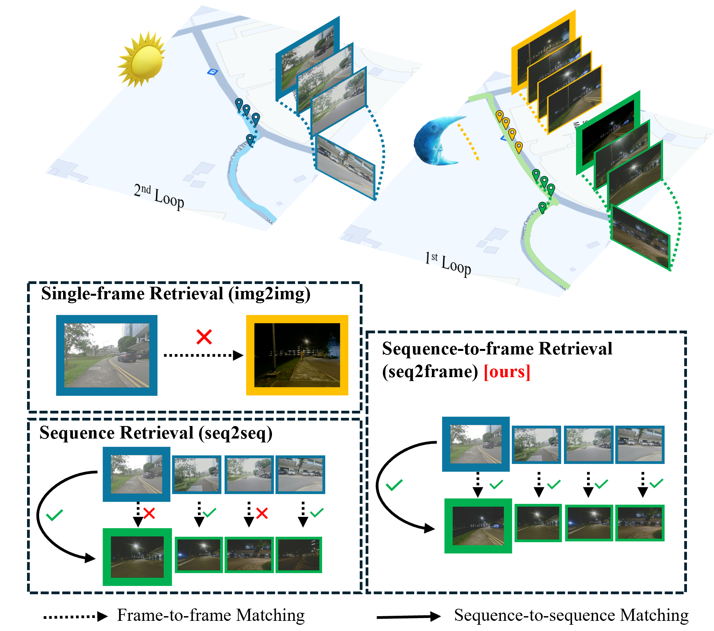

# CaseVPR: Correlation-Aware Sequential Embedding for  Sequence-to-Frame Visual Place Recognition
CaseVPR is a sequence-based visual place recognition (VPR) pipeline. This repository provides 
- a sequence encoder [training & evaluation pipeline](#sequence-encoder-training) that:

  - Finetune sequence encoders with sequence inputs.

  - Evaluates trained sequence encoders with sequence retrieval metric (Recall@).

- a flexible, on-the-fly [inference and evaluation framework](#pipeline-evaluations) that:

  - Ingests and processes image sequences as they arrive.

  - Extracts per-frame descriptors, then optionally aggregates them into a sequence embedding, using the chosen frontend.

  - Matches sequences against a reference database with optional backends.

  - Reports overall evaluation metrics (precision, recall, accuracy etc.)


**Note**: For single image pretraining you can refer to [OpenVPRLab](https://github.com/amaralibey/OpenVPRLab).

- [CaseVPR: Correlation-Aware Sequential Embedding for  Sequence-to-Frame Visual Place Recognition](#casevpr-correlation-aware-sequential-embedding-for--sequence-to-frame-visual-place-recognition)
- [Abstract](#abstract)
- [Installation](#installation)
  - [1. Using Docker (recommended)](#1-using-docker-recommended)
  - [2. Manual Installation](#2-manual-installation)
- [Datasets and Weights](#datasets-and-weights)
  - [Sequence Retrieval Results (R@1 / R@5 / R@10)](#sequence-retrieval-results-r1--r5--r10)
  - [Image-level Correspondence Precision](#image-level-correspondence-precision)
- [Sequence Encoder Training](#sequence-encoder-training)
  - [1. Prepare a Training Config](#1-prepare-a-training-config)
  - [2. Launch Training](#2-launch-training)
  - [3. Evaluate Trained Sequence Encoder](#3-evaluate-trained-sequence-encoder)
- [Pipeline Evaluations](#pipeline-evaluations)
  - [1. Prepare a Test Configuration](#1-prepare-a-test-configuration)
  - [2. Adjust Model and Dataset Paths](#2-adjust-model-and-dataset-paths)
  - [3. Run the Evaluations](#3-run-the-evaluations)
    - [Caching Behavior](#caching-behavior)
  - [4. Inspect Results](#4-inspect-results)
- [Supplementary Material](#supplementary-material)
- [Citation](#citation)
- [Contact](#contact)
- [Acknowledgement](#acknowledgement)


# Abstract
Visual Place Recognition (VPR) is crucial for autonomous vehicles, as it enables their identification of previously visited locations. 
Compared with conventional single-frame retrieval, leveraging sequences of frames to depict places has been proven effective in alleviating perceptual aliasing.
However, mainstream sequence retrieval methods encode multiple frames into a single descriptor, relinquishing the capacity of fine-grained frame-to-frame matching.
This limitation hampers the precise positioning of individual frames within the query sequence.
On the other hand, sequence matching methods such as SeqSLAM are capable of frame-to-frame matching, but they rely on global brute-force search and the constant speed assumption, which may result in retrieval failures.
To address the above issues, we propose a sequence-to-frame hierarchical matching pipeline for VPR, named CaseVPR.
It consists of coarse-level sequence retrieval based on sequential descriptor matching to mine potential starting points, followed by fine-grained sequence matching to find frame-to-frame correspondence. 
Particularly, a CaseNet is proposed to encode the correlation-aware features of consecutive frames into hierarchical descriptors for sequence retrieval and matching.
On this basis, an AdaptSeq-V2 searching strategy is proposed to identify frame-level correspondences of the query sequence in candidate regions determined by potential starting points.
To validate our hierarchical pipeline, we evaluate CaseVPR on multiple datasets.
Experiments demonstrate that our CaseVPR outperforms all benchmark methods in terms of average precision, and achieves new State-of-the-art (SOTA) results for sequence-based VPR.

Sequence-based paradigms for VPR. (a) Sequence retrieval encodes multiple frames into a single descriptor, losing the ability of frame-to-frame matching. (b) Sequence matching relies on brute-force search and constant speed assumption, which may lead to retrieval failures. (c) Our sequence-to-frame hierarchical matching pipeline combines the advantages of both paradigms, enabling coarse-level sequence retrieval followed by fine-grained sequence matching.

# Installation

## 1. Using Docker (recommended)
For ease of setup, use the [`docker-compose.yml`](docker-comopse.yml) file or the [`.devcontainer`](.devcontainer/devcontainer.json) configuration with VSCode's Remote - Containers extension. Before running, ensure to modify the [`docker-compose.yml`](docker-comopse.yml) file to correctly map the paths to the datasets.

## 2. Manual Installation
Install all required Python packages:
```
pip install -r docker/requirements.txt
pip install -e .
```


# Datasets and Weights
The datasets used in this work can be found [here](https://entuedu-my.sharepoint.com/:f:/g/personal/heshan001_e_ntu_edu_sg/EltYH4z4SNRKuXKfYZuu6moBiUjT93zvERTsLF0aGPzgGA?e=iB7PMg).

The weights are available [here](https://entuedu-my.sharepoint.com/:f:/g/personal/heshan001_e_ntu_edu_sg/EjiHgyO279tPpwO-mmJiVp0BYuFQhboFxG0cS8-4NGm_0Q?e=e8FQAh).

## Sequence Retrieval Results (R@1 / R@5 / R@10)

| Model      | Oxford1 | Oxford1_v | Oxford2 | NYL | SRC |
|------------|---------|-----------|---------|-----|-----|
| SeqNet     | 24.9 / 37.2 / 44.7 | 22.9 / 34.4 / 42.5 | 12.7 / 20.0 / 25.6 | 44.1 / 53.1 / 59.2 | 38.4 / 49.0 / 55.4 |
| SeqVLAD    | 70.2 / 82.0 / 88.2 | 69.7 / 79.6 / 85.7 | 38.9 / 52.7 / 59.5 | 39.8 / 51.1 / 58.1 | 31.6 / 42.3 / 48.0 |
| JIST       | 61.3 / 74.5 / 82.0 | 58.9 / 72.8 / 80.2 | 30.9 / 42.5 / 49.2 | 56.6 / 66.4 / 74.8 | 53.5 / 64.9 / 70.6 |
| sVPR       | 35.1 / 47.9 / 57.3 | 40.9 / 56.5 / 64.4 | 11.2 / 18.9 / 24.7 | 42.3 / 49.2 / 55.1 | 51.9 / 63.5 / 70.1 |
| CaseNet    | 90.8 / 96.7 / 98.2 | 85.4 / 93.6 / 96.0 | 71.5 / 83.0 / 88.3 | 84.9 / 90.4 / 94.0 | 84.4 / 92.1 / 95.8 |
| CaseNet_ft | 93.5 / 97.7 / 98.5 | 86.1 / 94.4 / 96.4 | 77.7 / 87.4 / 91.3 | 86.1 / 90.5 / 94.4 | 85.6 / 92.9 / 96.8 |

> **Known Issues**:
> - All experiments slightly differ from the numbers in the paper due to non-deterministic operations in the original setup.
> - `SeqNet` differs from the reported numbers in the original paper, due to a wrong batch/sequence split in original implementation of `SeqNet`.

## Image-level Correspondence Precision
| Image Encoder | Sequence Encoder | Sequence Matcher | Oxford1 | Oxford1_v | Oxford2 | NYL    | SRC    | Sp2F   | W2F    | Sm2Sp  |
|----------------------|----------------|------------------|---------|-----------|---------|--------|--------|--------|--------|--------|
| NetVLAD             | ×              | ×                | 7.45    | 14.74     | 3.89    | 38.93  | 26.94  | 43.33  | 16.38  | 39.88  |
| EigenPlace_ft        | ×              | ×                | 37.35   | 46.86     | 15.30   | 54.56  | 43.71  | 74.09  | 32.00  | 60.39  |
| MixVPR               | ×              | ×                | 32.29   | 44.78     | 14.42   | 71.53  | 53.98  | 90.87  | 71.71  | 88.45  |
| SALAD                | ×              | ×                | 42.11   | 54.36     | 27.64   | 78.11  | 48.76  | 92.99  | 78.49  | 92.39  |
| CliqueMining         | ×              | ×                | 37.71   | 51.13     | 23.59   | 63.78  | 40.71  | 94.75  | 82.81  | 94.65  |
| BoQ                  | ×              | ×                | 46.24   | 55.82     | 37.32   | 83.08  | 58.80  | 93.33  | 84.17  | 93.89  |
| CricaVPR             | ×              | ×                | 39.19   | 52.81     | 26.21   | 78.59  | 57.26  | 91.65  | 74.09  | 88.57  |
| ×                    | SeqVLAD_ft     | ×                | 24.02   | 36.28     | 11.62   | 34.85  | 19.50  | 18.78  | 6.96   | 16.24  |
| ×                    | JIST           | ×                | 18.83   | 29.26     | 9.96    | 46.96  | 31.90  | 60.65  | 44.63  | 62.53  |
| ×                    | sVPR           | ×                | 10.84   | 21.45     | 3.47    | 39.18  | 33.06  | 26.15  | 10.13  | 24.97  |
| NetVLAD              | ×              | SeqSLAM          | 10.29   | 18.06     | 5.83    | 44.84  | 27.71  | 37.35  | 15.18  | 33.24  |
| NetVLAD              | ×              | AdaptSeq         | 8.38    | 14.17     | 5.10    | 45.96  | 29.70  | 41.99  | 15.70  | 37.59  |
| EigenPlace_ft        | ×              | SeqSLAM          | 43.41   | 49.58     | 21.24   | 57.49  | 43.51  | 59.34  | 29.95  | 49.35  |
| EigenPlace_ft        | ×              | AdaptSeq         | 38.05   | 47.79     | 16.83   | 55.09  | 42.62  | 65.00  | 30.96  | 50.18  |
| CricaVPR             | ×              | SeqSLAM          | 46.96   | 57.75     | 33.71   | 81.23  | 60.46  | 68.98  | 61.69  | 67.82  |
| CricaVPR             | ×              | AdaptSeq         | 40.16   | 50.84     | 26.49   | 79.90  | 58.02  | 87.12  | 73.04  | 79.41  |
| NetVLAD              | SeqVLAD_ft     | AdaptSeq-V2      | 23.00   | 34.55     | 13.44   | 41.41  | 27.33  | 36.13  | 12.39  | 31.24  |
| EigenPlace_ft        | SeqVLAD_ft     | AdaptSeq-V2      | 35.72   | 46.30     | 16.06   | 41.98  | 28.05  | 41.87  | 12.57  | 34.09  |
| EigenPlace_ft        | JIST           | AdaptSeq-V2      | 31.81   | 42.65     | 13.86   | 54.50  | 41.44  | 84.27  | 54.24  | 77.32  |
| EigenPlace_ft        | sVPR           | AdaptSeq-V2      | 22.21   | 35.26     | 7.41    | 44.39  | 42.13  | 54.90  | 20.84  | 49.00  |
| CricaVPR             | SeqVLAD_ft     | AdaptSeq-V2      | 36.15   | 51.66     | 22.05   | 45.03  | 30.00  | 45.04  | 14.86  | 37.59  |
| CricaVPR             | JIST           | AdaptSeq-V2      | 33.78   | 45.09     | 16.22   | 60.61  | 44.95  | 92.02  | 72.40  | 87.85  |
| CricaVPR             | sVPR           | AdaptSeq-V2      | 23.17   | 37.98     | 8.30    | 46.38  | 44.36  | 59.26  | 25.13  | 54.91  |
| SeqNet               | ×              | ×                | 10.91   | 17.22     | 5.41    | 43.60  | 26.61  | 44.57  | 17.47  | 41.76  |
| CaseVPR224 | ×              | ×                | 46.20   | 58.41     | 33.09   | 81.83  | 63.08  | 92.34  | 82.99  | 90.26  |
| CaseVPR224_ft | ×              | ×                | 47.26   | 63.66     | 37.30   | 82.83  | 63.71  | 91.44  | 79.74  | 89.56  |
| CaseVPR322_ft | ×              | ×                | 51.17   | 63.61     | 41.85   | 82.16  | 64.57  | 92.72  | 83.49  | 93.00  |

> **NOTE**: Models with `_ft` are fine-tuned on Oxford-RobotCar, others are initialized by pre-trained weight.


# Sequence Encoder Training

## 1. Prepare a Training Config
* **Config template** – start from `scripts/configs/training/example_hvpr_casevpr.json` and edit dataset paths, sequence length, optimiser parameters, etc.
* **Dataset layout** – the trainer expects:
  ```
  /dataset_root
    /train
      /database
      /queries
        /sequence
          /* images */
    /other_splits (e.g. 2, 3, test)
  ```
* **Field reference** – every option is documented in the docstring at the top of `scripts/train.py`.

## 2. Launch Training
Execute the trainer with your config:

```bash
python scripts/train.py --config scripts/configs/training/example_hvpr_casevpr.json
```

The command creates a timestamped folder under `output/train_logs/`, copies the config, and streams logs/TensorBoard summaries. Use `--dry-run` to validate the config without starting training.

## 3. Evaluate Trained Sequence Encoder
* **Config** – use `scripts/configs/seq_eval/example_eval.json` and point `model.checkpoint` at the trained run. If you omit the field, the evaluator falls back to the default weight declared in `scripts/configs/model_configs.py`.
* **Command**

```bash
python scripts/eval_sequence.py --config scripts/configs/seq_eval/example_eval_hvpr_casevpr.json
```

# Pipeline Evaluations
## 1. Prepare a Test Configuration

Create a JSON file (e.g. `scripts/configs/eval/batch_tests.json`) with the following fields:

* **`test_lst`**
  Defines the datasets to evaluate. Each entry must specify:

  * `ds_name`: Dataset identifier
  * `l1`, `l2`: First- and second-loop split name
  * `positive_dist`: Radius for precision computation

* **`pipeline_lst`**
  Lists the pipelines to test. For each entry, the runner evaluates every combination of Frontends (`fe_lst`) and Backends (`be_lst`).

  > Note: A frontend name containing `+` denotes `{image_encoder}+{sequence_encoder}`.

* **`default_settings`**
  Global parameters applied to every test.

* **`settings_lst`** *(optional)*
  For ablation studies, list overrides relative to `default_settings`. Each element describes one variant.

For a complete field-by-field breakdown, check the docstring at the top of `scripts/eval.py`.


## 2. Adjust Model and Dataset Paths

* **`model_configs.py`**
  Update model arguments, such as weight locations or encoder parameters.

* **`ds_configs.py`**
  Specify dataset directories and any custom flags.


## 3. Run the Evaluations

Execute all configured tests in one command:

```bash
python scripts/eval.py \
  --json_path /path/to/batch_tests.json \
  --process_num 8 \
  --gpu_ids 0,1,2,3
```

### Caching Behavior

1. **First Loop**

   * Iterates over images to extract features
   * Checkpoints and intermediate features are stored under `output/ckpts`

2. **Second Loop**

   * Reloads saved checkpoints to avoid redundant computation
   * Saves encoder outputs (img & seq feats) to disk for fast ablation studies

Use the following flags to control caching:

* `--ignore_ckpt`
  Forces re-execution of the first loop.

* `--no_cache`
  Bypasses all existing caches of features.


## 4. Inspect Results

* **Per-test logs**: `output/test_logs/`
* **Aggregate summary**: `overall/overall_results.csv`

  > Tip: Open in VS Code with a table-view extension for easy filtering and sorting.


# Supplementary Material
Please refer to  [docs/SupplementaryMaterial.pdf](docs/SupplementaryMaterial.pdf) for more ablation studies and qualatative results.

# Citation
If you found this work helpful, please cite this paper
```
@ARTICLE{10884025,
  author={Li, Heshan and Peng, Guohao and Zhang, Jun and Wen, Mingxing and Ma, Yingchong and Wang, Danwei},
  journal={IEEE Robotics and Automation Letters}, 
  title={CaseVPR: Correlation-Aware Sequential Embedding for Sequence-to-Frame Visual Place Recognition}, 
  year={2025},
  volume={10},
  number={4},
  pages={3430-3437},
  keywords={Visual place recognition;Pipelines;Transformers;Feature extraction;Correlation;Training;Foundation models;Industries;Head;Data mining;Localization;ai-based methods},
  doi={10.1109/LRA.2025.3541452}}
}
```

# Contact
If you have any issue, kindly raise an issue or email to HESHAN001@e.ntu.edu.sg.

# Acknowledgement
This repo is based on / inspired by following works:
- [BoQ](https://github.com/amaralibey/Bag-of-Queries)
- [SALAD](https://github.com/serizba/salad)
- [MixVPR](https://github.com/amaralibey/MixVPR)
- [sVPR](https://github.com/tiev-tongji/Spatio-Temporal-SeqVPR)
- [VGT(SeqVLAD)](https://github.com/vandal-vpr/vg-transformers)
- [CricaVPR](https://github.com/Lu-Feng/CricaVPR)
- [pySeqSLAM](https://github.com/tmadl/pySeqSLAM)
- [seqNet](https://github.com/oravus/seqNet)
- [EigenPlace](https://github.com/gmberton/EigenPlaces)
